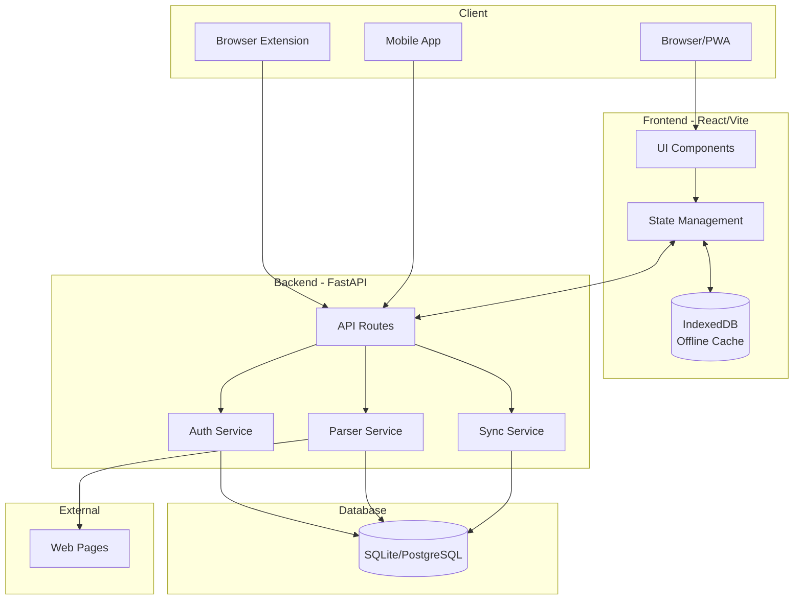
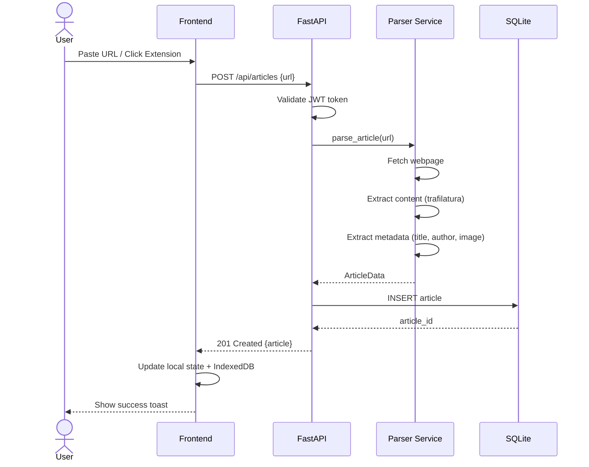
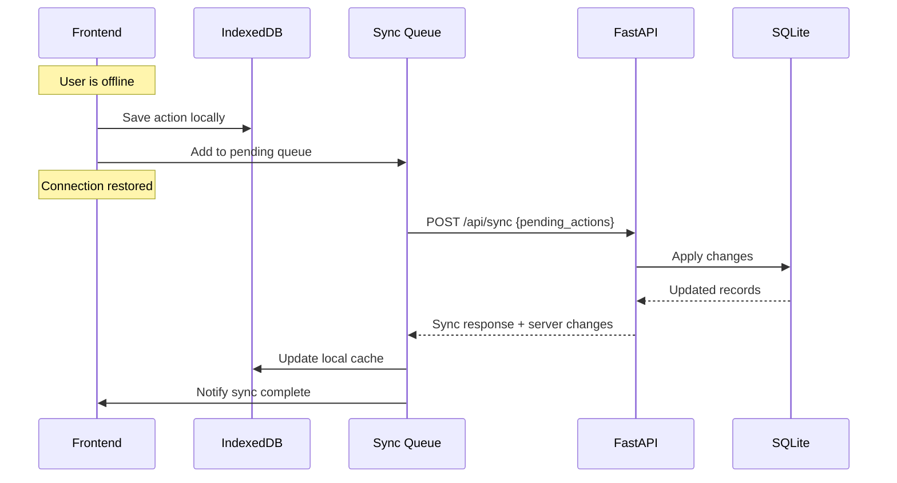
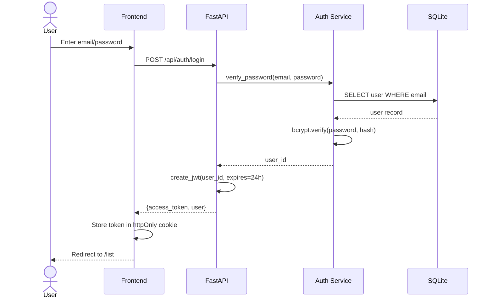
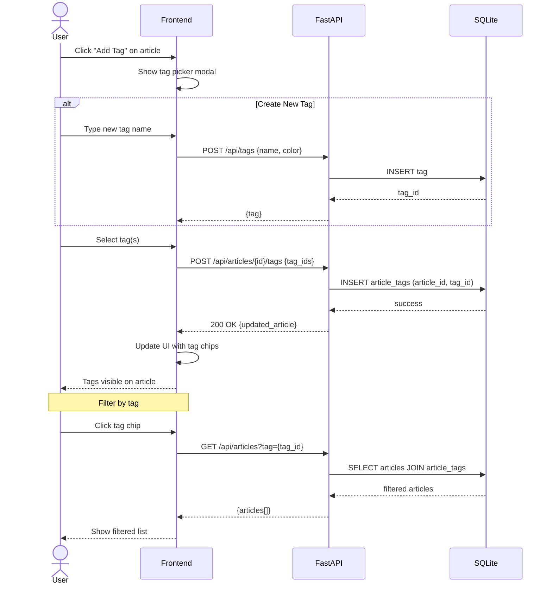
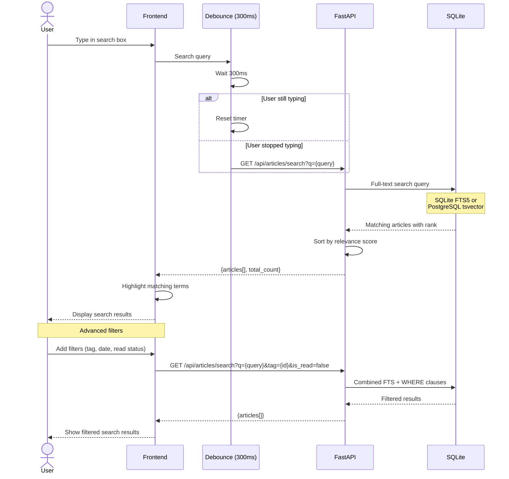

# CLAUDE.md

This file provides guidance to Claude Code (claude.ai/code) when working with code in this repository.

## Project Overview

This is a **greenfield project** for a personal read-it-later application (Pocket clone). The complete specification is in `pocket_clone_spec.md`. No code has been written yet - implementation should follow the phased approach outlined below.

**Goal:** Open-source, self-hostable app that users can easily run locally.

## Tech Stack

### Backend
- **Framework:** Python 3.11+ with FastAPI
- **Database:** SQLite (default, zero-config) with PostgreSQL as optional alternative
- **ORM:** SQLAlchemy with Alembic for migrations
- **Auth:** JWT tokens with python-jose, passwords hashed with passlib[bcrypt]
- **Content Parsing:** newspaper3k or trafilatura for article extraction

### Frontend
- **Framework:** React 18 with TypeScript
- **Build Tool:** Vite
- **Styling:** Tailwind CSS with shadcn/ui components
- **Offline Storage:** Dexie.js (IndexedDB wrapper)
- **Mobile:** React Native (Phase 5)

## System Architecture



## Key Flows

### 1. Save Article Flow


### 2. Offline Sync Flow


### 3. Authentication Flow


### 4. Tagging Flow


### 5. Search Flow


### Project Structure
```
pocket-app/
├── backend/
│   ├── app/
│   │   ├── main.py
│   │   ├── database.py
│   │   ├── models/
│   │   │   ├── __init__.py
│   │   │   ├── user.py
│   │   │   ├── article.py
│   │   │   ├── tag.py
│   │   │   └── article_tag.py
│   │   ├── schemas/
│   │   │   ├── __init__.py
│   │   │   ├── user.py
│   │   │   ├── article.py
│   │   │   └── tag.py
│   │   ├── routes/
│   │   │   ├── __init__.py
│   │   │   ├── auth.py
│   │   │   ├── articles.py
│   │   │   └── tags.py
│   │   └── services/
│   │       ├── __init__.py
│   │       ├── parser.py
│   │       └── sync.py
│   ├── alembic/
│   ├── tests/
│   └── requirements.txt
├── frontend/
│   ├── src/
│   │   ├── components/
│   │   ├── pages/
│   │   ├── hooks/
│   │   ├── services/
│   │   └── types/
│   └── package.json
├── docker-compose.yml
└── README.md
```

## Local Setup

```bash
# Without Docker
cd backend && pip install -r requirements.txt && python -m app.main
cd frontend && npm install && npm run dev

# With Docker
docker-compose up
```

## Implementation Phases

Follow these phases in order - each builds on the previous:

1. **Phase 1 (MVP):** Auth, URL saving, content parsing, article list, basic reader view
2. **Phase 2:** Tags, favorites, full-text search, reading preferences
3. **Phase 3:** Chrome/Firefox extensions, bookmarklet, PWA
4. **Phase 4:** Service workers, IndexedDB offline storage, real-time sync
5. **Phase 5:** React Native mobile apps

## Data Models

Core entities (see spec section 4.3 for full details):
- **User:** id, email, password_hash, preferences (JSON)
- **Article:** id, user_id, url, title, content, reading_position, is_read, is_favorite, is_archived
- **Tag:** id, user_id, name, color
- **ArticleTag:** article_id, tag_id (many-to-many)

## Key Architectural Decisions

- **Offline-first:** Queue actions when offline, sync on reconnect
- **Optimistic updates:** Update UI immediately, resolve conflicts via timestamps
- **Mobile-first responsive:** Breakpoints at 768px and 1024px
- **No tracking:** Privacy-focused, no analytics

## Performance Targets

- Article save: < 3 seconds
- List loading: < 1 second
- Reader view: < 500ms
- Search: < 500ms

## Keyboard Shortcuts (Web)

Implement these in the reader/list views:
- `A` - Archive | `F` - Favorite | `T` - Tags
- `J/K` - Navigate items | `/` - Focus search | `Esc` - Close reader
